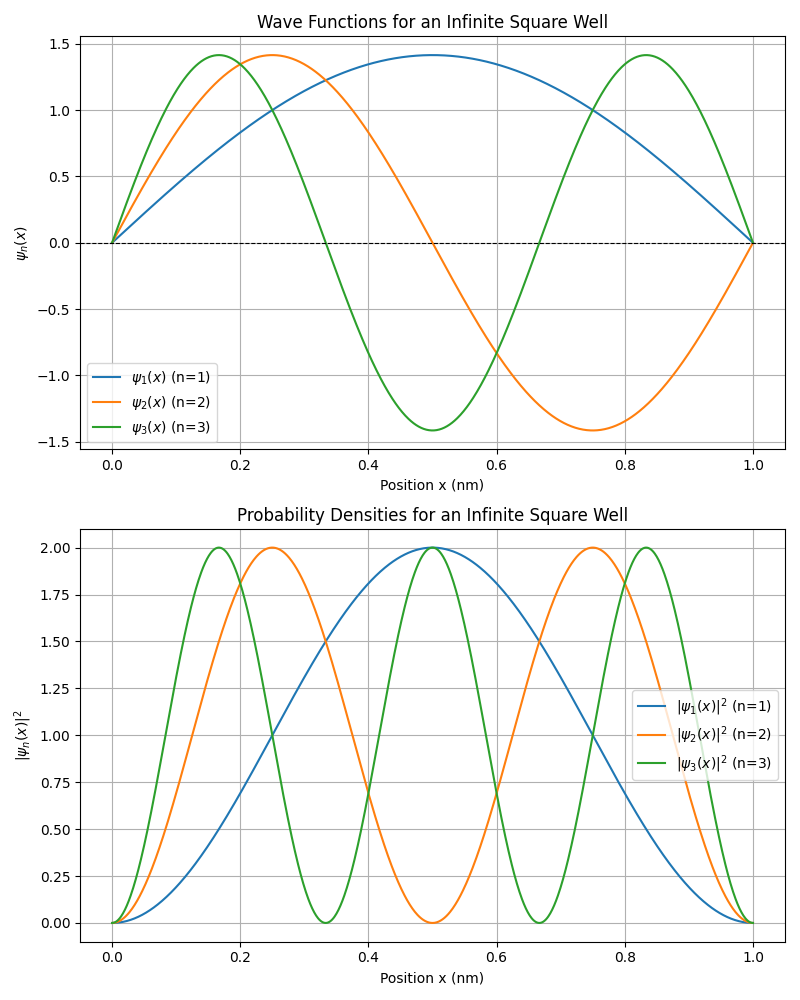
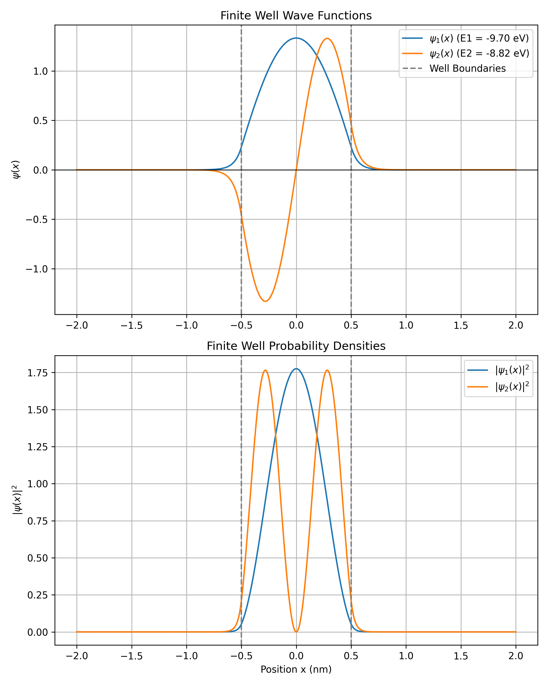

# Homework 1 Written Responses

## Problem 1 – Infinite Square Well

**Python Code:**
```python
#  -- Created with AI --

import numpy as np
import matplotlib.pyplot as plt

# constants
L = 1.0  # Width of the well in nm

# Define the normalized wave function
def psi(n, x, L):
    return np.sqrt(2 / L) * np.sin(n * np.pi * x / L)

# Generate an array of x values from 0 to L
x = np.linspace(0, L, 1000)

# Calculate wave functions for n=1, 2, 3
psi_1 = psi(1, x, L)
psi_2 = psi(2, x, L)
psi_3 = psi(3, x, L)

# Create a figure with two subplots stacked vertically
fig, (ax1, ax2) = plt.subplots(2, 1, figsize=(8, 10))

# 1. Plot the wave functions
ax1.plot(x, psi_1, label=r'$\psi_1(x)$ (n=1)')
ax1.plot(x, psi_2, label=r'$\psi_2(x)$ (n=2)')
ax1.plot(x, psi_3, label=r'$\psi_3(x)$ (n=3)')
ax1.set_title('Wave Functions for an Infinite Square Well')
ax1.set_xlabel('Position x (nm)')
ax1.set_ylabel(r'$\psi_n(x)$')
ax1.axhline(0, color='black', linewidth=0.8, linestyle='--')
ax1.legend()
ax1.grid(True)

# 2. Plot the probability densities
ax2.plot(x, np.abs(psi_1)**2, label=r'$|\psi_1(x)|^2$ (n=1)')
ax2.plot(x, np.abs(psi_2)**2, label=r'$|\psi_2(x)|^2$ (n=2)')
ax2.plot(x, np.abs(psi_3)**2, label=r'$|\psi_3(x)|^2$ (n=3)')
ax2.set_title('Probability Densities for an Infinite Square Well')
ax2.set_xlabel('Position x (nm)')
ax2.set_ylabel(r'$|\psi_n(x)|^2$')
ax2.legend()
ax2.grid(True)

plt.tight_layout()
plt.savefig('HW1/problem1_plots.png')
```



**How does the number of nodes relate to the quantum number $n$?**

A node is basically where the wave function crosses the x-axis. If you look at the graphs, $n=1$ has 0 nodes, $n=2$ has 1 node, and $n=3$ has 2 nodes. So, as the quantum number $n$ goes up, the number of nodes increases linearly. For any $n$, there are exactly $n-1$ nodes inside the well.

## Problem 2 - Energy Quantization

**Python Code:**
```python
#  -- Created with AI --

import numpy as np

# Constants
h = 6.626e-34     
hbar = 1.055e-34    
m_e = 9.11e-31      
eV_to_J = 1.602e-19 
c = 3.00e8         
L = 1.0e-9   

def calc_energy_joules(n):
    # Formula: E_n = (n^2 * pi^2 * hbar^2) / (2 * m * L^2)
    return (n**2 * np.pi**2 * hbar**2) / (2 * m_e * L**2)

# 1. Calculate the first three allowed energy levels in eV
print("--- First Three Allowed Energy Levels ---")
energies_joules = [calc_energy_joules(n) for n in]
energies_eV = [e / eV_to_J for e in energies_joules]

for n, energy in zip(, energies_eV):
    print(f"E_{n} = {energy:.4f} eV")

# 2. Determine the wavelength of the photon emitted during the transition n = 3 -> n = 1
print("\n--- Wavelength for Transition (n=3 -> n=1) ---")
delta_E_J = energies_joules - energies_joules

wavelength_m = (h * c) / delta_E_J
wavelength_nm = wavelength_m * 1e9 # meters -> nanometers

print(f"Wavelength (\u03BB) = {wavelength_nm:.2f} nm")
```

**Code Output**

--- First Three Allowed Energy Levels ---  
E_1 = 0.3764 eV  
E_2 = 1.5054 eV  
E_3 = 3.3872 eV  

--- Wavelength for Transition (n=3 -> n=1) ---  
Wavelength (λ) = 412.12 nm  

**Explain qualitatively why the energy levels become more widely separated as $n$ increases.**

In an infinite square well, a particle's energy scales quadratically with $n$ ($E_n \propto n^2$). If we look at the gap between any two adjacent levels ($\Delta E = E_{n+1} - E_n$), the difference scales like $(n+1)^2 - n^2 = 2n + 1$. Because $2n + 1$ grows as $n$ gets larger, the gap between the energy levels just keeps getting wider the higher you go.

## Problem 3 – Finite Well Bound States

**Python Code:**
```python
#  -- Created with AI -- 

import numpy as np
import matplotlib.pyplot as plt

# Constants
hbar = 1.055e-34
m_e = 9.11e-31    
eV_to_J = 1.602e-19
a = 0.5        
U0 = 10.0       

# Calculate the kinetic energy coefficient (hbar^2 / 2m) in eV * nm^2
const = (hbar**2) / (2 * m_e) / eV_to_J * 1e18

# Set up the spatial grid (from -2 nm to 2 nm to see outside the well)
N = 1000
L_max = 2.0  
x = np.linspace(-L_max, L_max, N)
dx = x - x

# Define the potential V(x)
V = np.where(np.abs(x) < a, -U0, 0.0)

# Construct the Hamiltonian matrix (H = T + V) using finite difference
H = np.zeros((N, N))
for i in range(N):
    H[i, i] = const * (2.0 / dx**2) + V[i]
    if i > 0:
        H[i, i-1] = -const / dx**2
    if i < N - 1:
        H[i, i+1] = -const / dx**2

# Solve for eigenvalues and eigenvectors
energies, wavefunctions = np.linalg.eigh(H)

# Extract and properly normalize the first two bound states
E1, E2 = energies, energies
psi1 = wavefunctions[:, 0] / np.sqrt(dx)
psi2 = wavefunctions[:, 1] / np.sqrt(dx)

print(f"First bound-state energy: {E1:.4f} eV")
print(f"Second bound-state energy: {E2:.4f} eV")

# Plotting Wave functions and Probability Densities
fig, (ax1, ax2) = plt.subplots(2, 1, figsize=(8, 10))

# 1. Wave functions
ax1.plot(x, psi1, label=rf"$\psi_1(x)$ (E1 = {E1:.2f} eV)")
ax1.plot(x, psi2, label=rf"$\psi_2(x)$ (E2 = {E2:.2f} eV)")
ax1.axvline(-a, color='gray', linestyle='--', label='Well Boundaries')
ax1.axvline(a, color='gray', linestyle='--')
ax1.axhline(0, color='black', linewidth=0.8)
ax1.set_title("Finite Well Wave Functions")
ax1.set_ylabel(r"$\psi(x)$")
ax1.legend()
ax1.grid(True)

# 2. Probability Densities
ax2.plot(x, np.abs(psi1)**2, label=r"$|\psi_1(x)|^2$")
ax2.plot(x, np.abs(psi2)**2, label=r"$|\psi_2(x)|^2$")
ax2.axvline(-a, color='gray', linestyle='--')
ax2.axvline(a, color='gray', linestyle='--')
ax2.set_title("Finite Well Probability Densities")
ax2.set_xlabel("Position x (nm)")
ax2.set_ylabel(r"$|\psi(x)|^2$")
ax2.legend()
ax2.grid(True)

plt.tight_layout()
plt.savefig('HW1/problem3_finite_well_states.png', dpi=300)
```

**Code Output**

First bound-state energy: -9.7027 eV  
Second bound-state energy: -8.8151 eV  



## Problem 4 – Infinite vs Finite Well Comparison

**Why are the energy levels of the finite well lower than those of the infinite well?**

In a finite well, the wave function isn't cut off instantly at the edges—it kind of "leaks" out a bit. Because the wave spreads out more, its effective width is larger. Since energy is inversely related to the width squared ($E \propto 1/L^2$), spreading out lowers the particle's energy. So, the finite well ends up with lower energy levels than the infinite well.

**Why does tunneling occur in the finite well but not in the infinite well?**

Tunneling happens when a particle has a chance of showing up outside the well, even if it classically doesn't have enough energy to break out. In an infinite well, the walls are literally impossible to get past (since it would require infinite energy), so the probability drops to exactly zero at the boundaries. But in our finite well, the walls are only 10 eV high. The wave function decays exponentially but doesn't instantly hit zero, which means there's a small but real chance the particle tunnels through.

**Compare the shapes of the wave functions near the boundaries.**

For the infinite well, the wave functions just crash into the walls and abruptly go to zero, making a sharp corner. But for the finite well, the transition is a lot smoother. The wave transitions cleanly from a standard wave inside the well to an exponentially decaying curve outside.

**Which system more closely resembles real physical systems? Explain.**

The finite well is definitely closer to reality. In the real world, nothing has "infinite" energy or infinite walls. It always takes some specific amount of energy to break a particle free. For example, knocking an electron out of a hydrogen atom takes exactly 13.6 eV. It's not trapped forever, which perfectly matches how our finite well model behaves.

---

## Problem 5 – Reflection

Basically, quantization means a trapped particle can't just have any random energy value. Its possible energy values can only be at certain values as energy can only be transferred in packets. This happens because of boundary conditions. When we force the wave function to be zero at the walls, we're basically creating standing waves. Only waves with specific wavelengths and energies fit perfectly inside the well without breaking those boundary rules.
