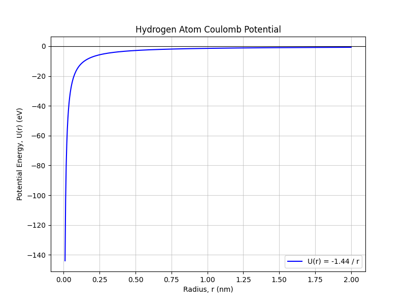
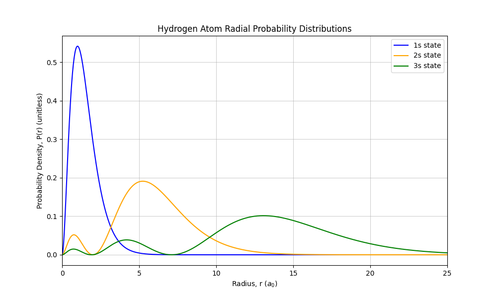
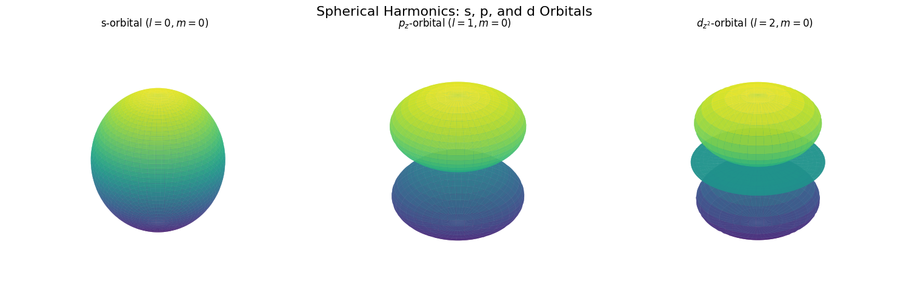

# Homework 2 Written Responses

## Problem 1 – Calculate H energy levels

**Python Code:**
```python
# -- Created With AI --

import numpy as np
import matplotlib.pyplot as plt

# Problem 1: Calculate H energy levels for n=1, 2, 3, 4, 5, 6 in eV.

# energy levels of a Hydrogen atom are E_n = -13.6 eV / n^2
E1 = -13.6 # ground state
n_values = np.array()

# Calculate the quantized energy levels
energy_levels = E1 / (n_values**2)

# Print the numerical calculations
print("Hydrogen Atom Energy Levels:")
for n, E in zip(n_values, energy_levels):
    print(f"n={n}: {E:.3f} eV")
```

**Code Output**

Hydrogen Atom Energy Levels:  
n=1: -13.600 eV  
n=2: -3.400 eV  
n=3: -1.511 eV  
n=4: -0.850 eV  
n=5: -0.544 eV  
n=6: -0.378 eV  

**Explanation**

The energy levels of the Hydrogen atom are quantized and scale as $1/n^2$. As the quantum number $n$ increases, the energy levels become closer together, eventually approaching 0 eV. Thsi is where the electron is no longer bound to the nucleus.

---

## Problem 2 – Plot Coulomb Potential

**Python Code:**
```python
# -- Created With AI --

import numpy as np
import matplotlib.pyplot as plt

# Problem 2: Plot Coulomb Potential (U(r)) from r=0.01 nm to r=2 nm. Convert energy axis to eV.

# The constant for Coulomb potential
k_e2 = 1.44 

r = np.linspace(0.01, 2.0, 500)

# Calculate Coulomb Potential U(r) = -k*e^2 / r
U_r = -k_e2 / r

# Plot potential
plt.figure(figsize=(8, 6))
plt.plot(r, U_r, 'b-', label='U(r) = -1.44 / r')

plt.title("Hydrogen Atom Coulomb Potential")
plt.xlabel("Radius, r (nm)")
plt.ylabel("Potential Energy, U(r) (eV)")
plt.grid(True, alpha=0.6)
plt.axhline(0, color='black', linewidth=0.8)
plt.legend()
plt.savefig('HW2/hw2_problem2.png')
```



**Explanation**

The Coulomb potential $U(r) = -ke^2/r$ represents the attraction between the positively charged proton and the negatively charged electron. By converting the constant $ke^2$ to approximately $1.44 \text{ eV}\cdot\text{nm}$, we can plot the potential directly in eV against the radius in nm. The potential approaches $-\infty$ as $r \to 0$ and approaches $0$ as $r \to \infty$.

---

## Problem 3 – Calculate Bohr radius

**Python Code:**
```python
# -- Created With AI --

import numpy as np

# Problem 3: Calculate Bohr radius in Angstroms.

# Constants
hbar = 1.055e-34 
m_e = 9.11e-31       
e = 1.602e-19
epsilon_0 = 8.854e-12

# The Bohr radius formula is: a_0 = (4 * pi * epsilon_0 * hbar^2) / (m_e * e^2)
numerator = 4 * np.pi * epsilon_0 * (hbar**2)
denominator = m_e * (e**2)

a_0_meters = numerator / denominator

# Convert meters to Angstroms (1 Angstrom = 10^-10 meters)
a_0_angstroms = a_0_meters * 1e10

# Output
print("--- Problem 3: Bohr Radius Calculation ---")
print(f"Calculated Bohr Radius (a_0) in meters: {a_0_meters:.4e} m")
print(f"Calculated Bohr Radius (a_0) in Angstroms: {a_0_angstroms:.4f} Å")
```

**Code Output**

--- Problem 3: Bohr Radius Calculation ---  
Calculated Bohr Radius $(a_0)$ in meters: 5.2968e-11 m  
Calculated Bohr Radius $(a_0)$ in Angstroms: 0.5297 Å  

**Explanation**

The Bohr radius ($a_0$) represents the most probable distance between the nucleus and the electron in a hydrogen atom in its ground state. The calculated value is approximately $0.5297 \text{ \AA}$.

---

## Problem 4 – Plot H atom radial probability distributions

**Python Code:**
```python
# -- Created With AI --

import numpy as np
import matplotlib.pyplot as plt

# Problem 4: Plot H atom radial probability distributions for 1s, 2s, and 3s states.

# Create an array of r values from 0 to 25 a_0
r = np.linspace(0, 25, 1000)

# R_1s (ground state): peaks at r = a_0
R_1s = 2 * np.exp(-r)

# R_2s (excited state): one node
R_2s = (1 / np.sqrt(2)) * (1 - r/2) * np.exp(-r/2)

# R_3s (excited state): two nodes
R_3s = (2 / (3 * np.sqrt(3))) * (1 - 2*r/3 + 2*r**2/27) * np.exp(-r/3)

# Calculate radial probability distributions P(r) = r^2 * R(r)^2
P_1s = (r**2) * (R_1s**2)
P_2s = (r**2) * (R_2s**2)
P_3s = (r**2) * (R_3s**2)

# Plotting
plt.figure(figsize=(10, 6))
plt.plot(r, P_1s, label='1s state', color='blue')
plt.plot(r, P_2s, label='2s state', color='orange')
plt.plot(r, P_3s, label='3s state', color='green')

plt.title("Hydrogen Atom Radial Probability Distributions")
plt.xlabel("Radius, r ($a_0$)")
plt.ylabel("Probability Density, P(r) (unitless)")
plt.grid(True, alpha=0.6)
plt.legend()
plt.xlim(0, 25)
plt.savefig('HW2/hw2_problem4.png')
```



**Explanation**

The radial probability density $P(r) = r^2 |R(r)|^2$ gives the probability of finding the electron at a distance $r$ from the nucleus within a spherical shell. The number of radial nodes (where the probability drops to zero) is given by the formula $n - l - 1$. For $s$-orbitals ($l=0$), the 1s state has 0 nodes, the 2s state has 1 node, and the 3s state has 2 nodes. 

---

## Problem 5 – Use spherical harmonics to visualize orbitals

**Python Code:**
```python
# -- Created With AI --

import numpy as np
import matplotlib.pyplot as plt
from scipy.special import sph_harm_y

# Problem 5: Use spherical harmonics to visualize s, p, and d orbitals.
# We will use 3D surface plots showing the probability density

# Create an angular grid
# theta: azimuthal angle
# phi: polar angle
theta = np.linspace(0, 2 * np.pi, 100)
phi = np.linspace(0, np.pi, 100)
theta, phi = np.meshgrid(theta, phi)

def plot_orbital(ax, l, m, title):
    """Calculates and plots the 3D surface of a spherical harmonic."""
    # Calculate the spherical harmonic
    Y = sph_harm_y(l, m, phi, theta)
    
    # Use probability density for the radius to show orbital lobes
    R = np.abs(Y)**2
    
    # Convert spherical to Cartesian coordinates for 3D plotting
    X = R * np.sin(phi) * np.cos(theta)
    Y_cart = R * np.sin(phi) * np.sin(theta)
    Z = R * np.cos(phi)
    
    # Plot the 3D surface
    ax.plot_surface(X, Y_cart, Z, cmap='viridis', edgecolor='none', alpha=0.8)
    
    # Formatting
    ax.set_title(title, pad=10)
    ax.set_box_aspect([1, 1, 1])
    ax.axis('off')

# Create a figure with 3 subplots for s, p, and d orbitals
fig = plt.figure(figsize=(15, 5))

# Plot l=0, m=0
plot_orbital(fig.add_subplot(131, projection='3d'), 0, 0, "s-orbital ($l=0, m=0$)")

# Plot l=1, m=0
plot_orbital(fig.add_subplot(132, projection='3d'), 1, 0, "$p_z$-orbital ($l=1, m=0$)")

# Plot l=2, m=0
plot_orbital(fig.add_subplot(133, projection='3d'), 2, 0, "$d_{z^2}$-orbital ($l=2, m=0$)")

plt.suptitle("Spherical Harmonics: s, p, and d Orbitals", fontsize=16)
plt.tight_layout()
plt.savefig('HW2/hw2_problem5.png')
```



**Explanation**

Spherical harmonics $Y_l^m(\theta, \phi)$ describe the angular portion of the hydrogen wave functions. The quantum number $l$ determines the shape of the orbital:
*   **$s$-orbital ($l=0, m=0$):** Perfectly spherical
*   **$p_z$-orbital ($l=1, m=0$):** Contains two stacked circles
*   **$d_{z^2}$-orbital ($l=2, m=0$):** Contains three stacked circles